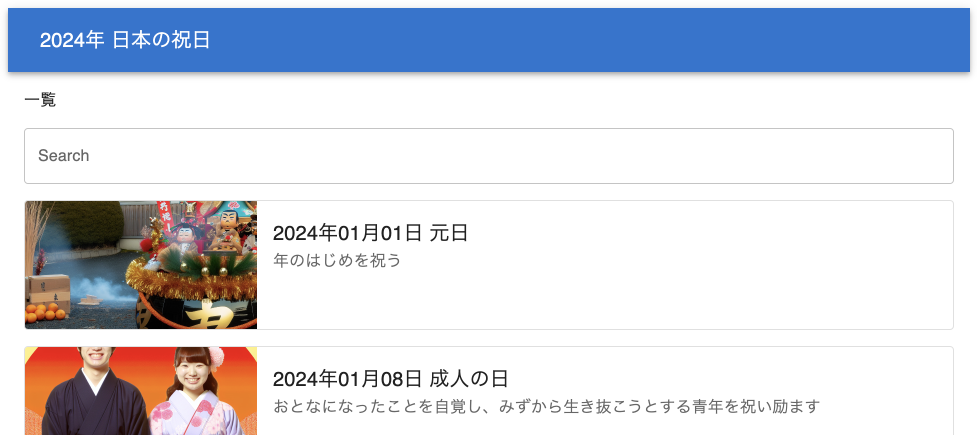

# React + TypeScript Webアプリ サンプル

## 使用法

次のコマンドにより開発サーバ(ポート5173)およびAPIサーバ(ポート3000)が起動します。

```
npm install
npm start
```

開発サーバが起動したらWebブラウザで http://localhost:5173 を開くとアプリにアクセスできます。



## Webアプリについて

このWebアプリは次のコマンドで作成した React + TypeScript アプリから出発して Azure OpenAI Studio における GPT-4o モデルとの対話により開発しました。

```
npm create vite@latest vite-react-1 -- --template react-swc-ts
```

WebアプリがアクセスするAPIサーバとして [json-server](https://github.com/typicode/json-server) 0.17.4 を使用しています。
[json-serverフォルダ](json-server)にAPIサーバが扱うデータベースJSONファイルや画像ファイルが格納されています。

WebアプリのUIコンポーネントとして [Material UI](https://mui.com) を使用しています。
新しいデータベースに対応し、外観を更新するには、次の場所を変更してみてください。
- [src/typees.d.ts](src/types.d.ts) ... APIで取得できるアイテムの型定義 `DataType`
- [src/DataListItem.tsx](src/DataListItem.tsx) ... データ一覧ページのアイテム表示コンポーネント `DataListItem`
- [src/DataDetailItem.tsx](src/DataDetailItem.tsx) ... データ詳細ページのアイテム表示コンポーネント `DataDetailItem`
