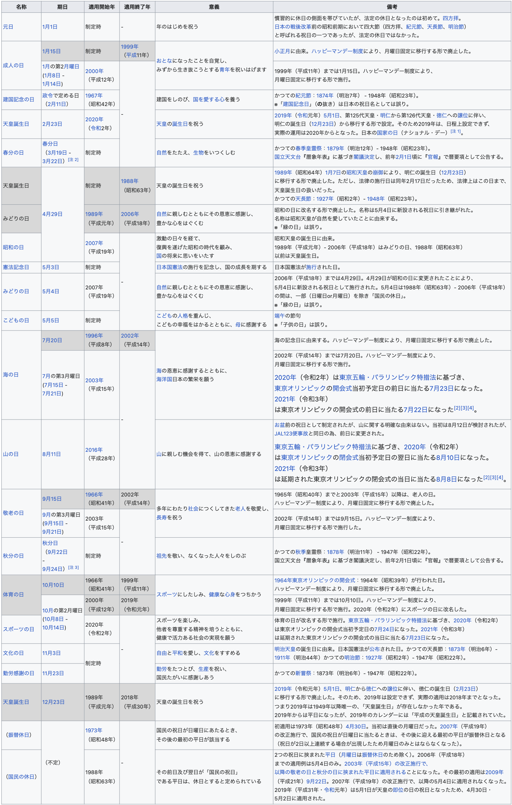

# json-server sample data: Japanese national holidays 2024

[json-server](https://github.com/typicode/json-server) のサンプルデータです。

[db.json](db.json) には2024年の日本の祝日の情報が含まれます。

データはWikipediaの[国民の祝日](https://ja.wikipedia.org/wiki/%E5%9B%BD%E6%B0%91%E3%81%AE%E7%A5%9D%E6%97%A5)の表の画像を元に
Azure OpenAI Studio における GPT-4o モデルとの対話で作成しました。



[public/assets](public/assets) には `YYYY-MM-DD.jpg` の形式で各祝日について生成した画像が含まれます。
同じく Azure OpenAI Studio で DALL-E 3 モデルに次のプロンプトを与えることで作成しました。

```
- 2024-01-01 元日: 年のはじめを祝う
- 2024-01-08 成人の日: おとなになったことを自覚し、みずから生き抜こうとする青年を祝い励ます
- 2024-02-11 建国記念の日: 建国をしのび、国を愛する心を養う
- 2024-02-23 天皇誕生日: 天皇の誕生を祝う
- 2024-03-20 春分の日: 自然をたたえ、生物をいつくしむ
- 2024-04-29 昭和の日: 激動の日々を経て、復興を遂げた昭和の時代を振り返り、将来の日本の発展を願う
- 2024-05-03 憲法記念日: 日本国憲法の施行を記念し、国の成長を期する
- 2024-05-04 みどりの日: 自然に親しむとともにその恩恵に感謝し、豊かな心をはぐくむ
- 2024-05-05 こどもの日: こどもの人格を重んじ、こどもの幸福をはかるとともに、母に感謝する
- 2024-07-15 海の日: 海の恩恵に感謝するとともに、海洋国日本の繁栄を願う
- 2024-08-11 山の日: 山に親しむ機会を得て、山の恩恵に感謝する
- 2024-09-16 敬老の日: 多年にわたり社会につくしてきた老人を敬愛し、長寿を祝う
- 2024-09-22 秋分の日: 祖先を敬い、なくなった人をしのぶ
- 2024-10-14 スポーツの日: スポーツにしたしみ、健康な心身をつちかう
- 2024-11-03 文化の日: 自由と平和を愛し、文化をすすめる
- 2024-11-23 勤労感謝の日: 勤労をたっとび、生産を祝い、国民たがいに感謝しあう
```
